2024 was a relatively eventful year. As usual I had a list of goals I wanted to try and accomplish, but
didn't even come close. 

## Goals

I made a post about my goals for 2024 [here](./my-goals-for-2024)

- Call my loved ones everyday: I didn't really keep track very well, but it could certainly have been much better.
- Achieve weight of 65kg: Nope, at 74.25 now. Hopefully it's all muscle :o
- Get 5 paying users for some product offering: currently sitting at 0.
- 1000 hours of guitar practice: also didn't keep track of this, and also, this probably could have been better.
- Achieve 16 kyu rank in the game "Go": pretty much gave up on the serious studying I was doing for Go, and ended up playing Chess far more.
- 12 books (3 in Japanese): fell quite short of this. I only got through 4 books in English, and maybe half of two books in Japanese. I did however read a lot of Manga in Japanese, but I don't entirely count it towards the goal.

However, in the honorable mentions I did ok:
- Blog once a month: I did blog a lot more, so I was happy with that.
- Make more friends: I certainly got to meet more people and make more friends, so I'm pretty happy about that too.
- Stay off my phone more: This one might be measurable, but based on feeling alone, I tried my best to stay off the phone by managing my tasks and calendar from my Hobonichi instead.
- Swim once a week: in the summer, I discovered that I can workout well with swimming in the summer without dying from itch, so I went swimming far more often. I didn't swim every week though, especially once it got cooler.

Given how random and unconcise these goals were, I think I really want to be a bit more focused, and precise for the following year...stay tuned.

## January

I started off my year how we all should - by feeding the capitalist machine, and experiencing the Japanese tradition that
is New Years sale. The deals are OK. There are certainly good things to be found, and I told myself I certainly should wait to buy any
electronic until this time.

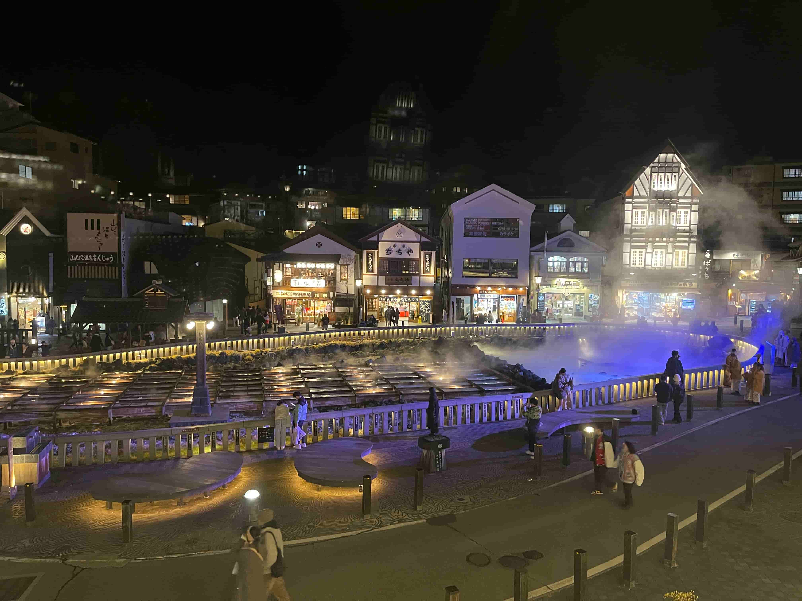

My first time in Kusatsu. We stayed two nights, and had a wonderful time. The hot springs/onsens were tremendous,
and the surrounding area is very nice too. I hope to go again when theres more snow to be able to hit the ski slopes.

## February

Despite it being a poor snow season - I still got a good amount of turns in, and I'm grateful for that. The above
is a picture from Eboshi ski resort.

## March

In march, friends of mine and I booked a trip to Europe. We stopped in London to watch some football
and it was phenomenal. I truly miss being able to watch the sport I love with great friends. Below is 
Craven Cottage in Fulham, the team [that Marcus Aurelius would support](https://www.youtube.com/watch?v=U0PfseIqJ98).

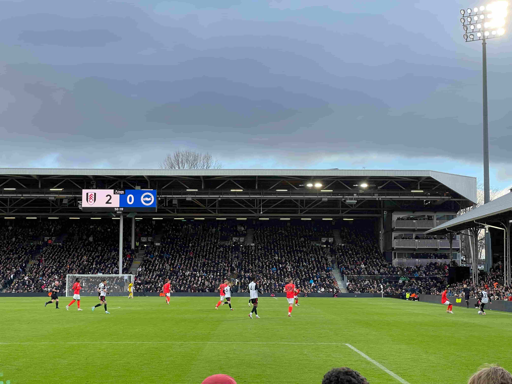

After that we took a nice flight over to Geneva, transferred over to Chamonix, and skiied one of the
most amazing mountains I've ever gotten to ski on. I am being quite serious when I think this experience
changed my life. I've never been the same.

After coming back, I thought I didn't have enough of traveling and decided I should catch a quick flight to Seoul,
since I've never been there.

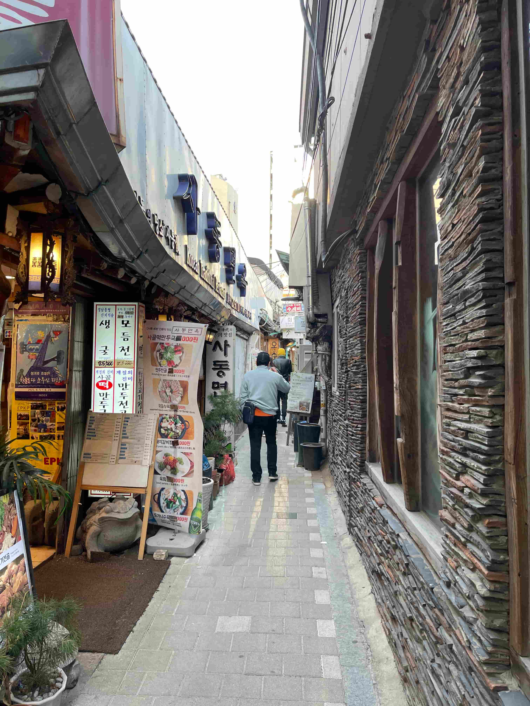

While Seoul just feels like Tokyo to me, the food was phenomenal, I thoroughly enjoyed it.

Lastly, to end an eventful month, I wanted to catch some more turns at Geto Kogen ski resort, maybe catch the small 
glimpses of powder. Unfortunately while there was powder the day before, it rained in the evening
giving a really unfortunate skiing environment. Still had fun!

## April

In April, for golden week, we got to explore Aomori, a northern prefecture from where I live. Needless to say, I fell in love.
I can imagine my next few country side trips will be to Aomori.

The above is a picture from Osorezan, or [Mount Osore](https://en.wikipedia.org/wiki/Mount_Osore), more specifically
from the temple, which is renowed for the monks being able to talk to the dead and it being an entrance to the Underworld.
You can definitely understand why when visiting as the entire place has a very powerful feeling to it. Wholeheartedly recommend.

From the temple, about a 2 hour drive you can reach a beautiful rock formation, Hotokegaura.

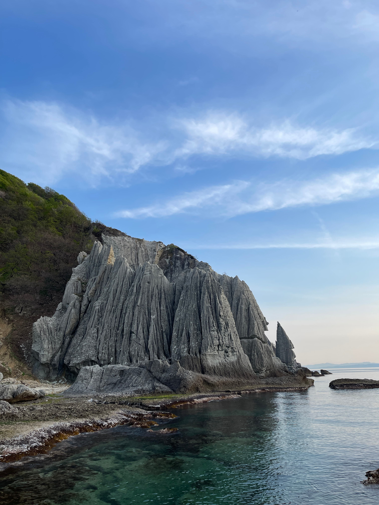

## May

As temperatures reached perfect, I got to do an amazing hike near Akiu, one of which I'll never forget!

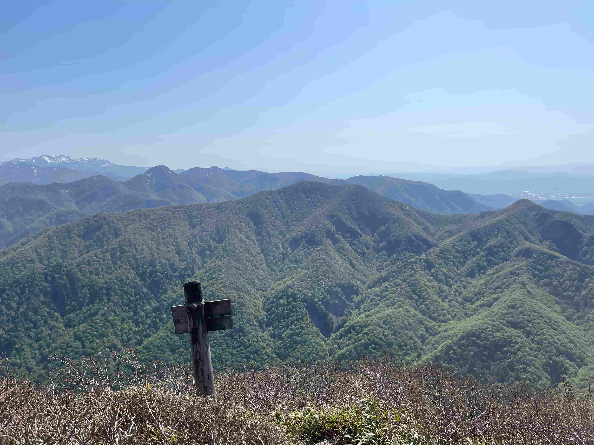

## June

Temperatures starting going up, so I didn't go out very much, but did get the chance to do some fun stuff,
such as plant sweet potatoes.

## July

Despite it being quite humid and hot, we did get to see the beautiful Yamadera with some friends.

Got to see Doctor Yellow in Nagoya:

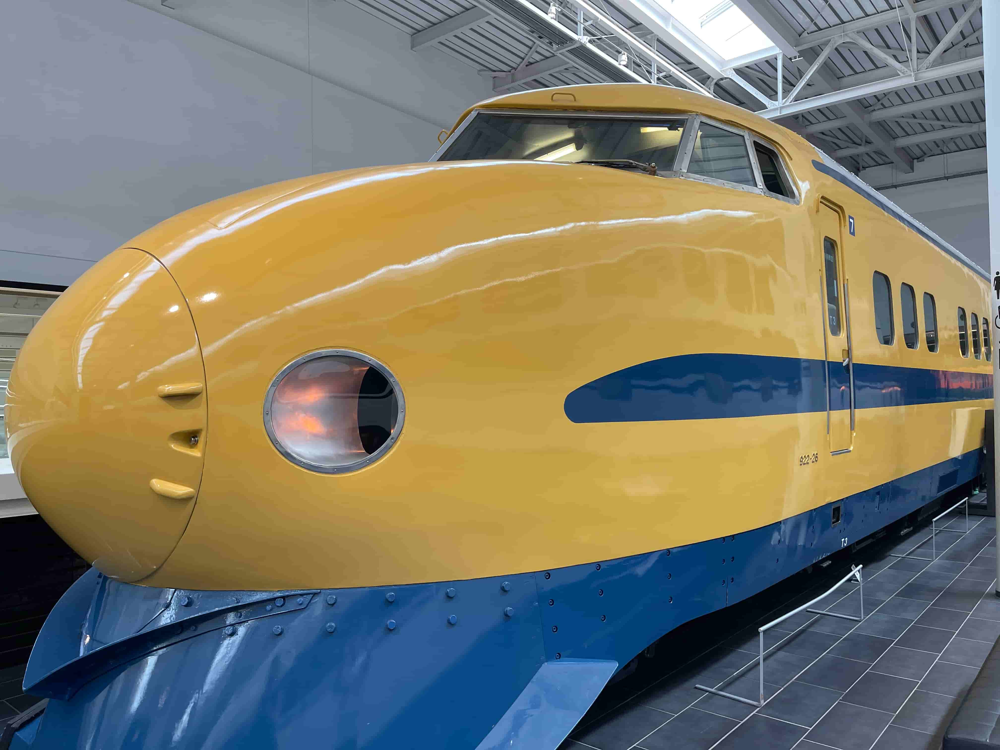

## August

Finally, with August being the worst month (I think) in terms of temperature, I tried my best
by not going out at all. I was unfortunately forced (not really) into a local countryside event
were they walk in traditional footware from the olden times:

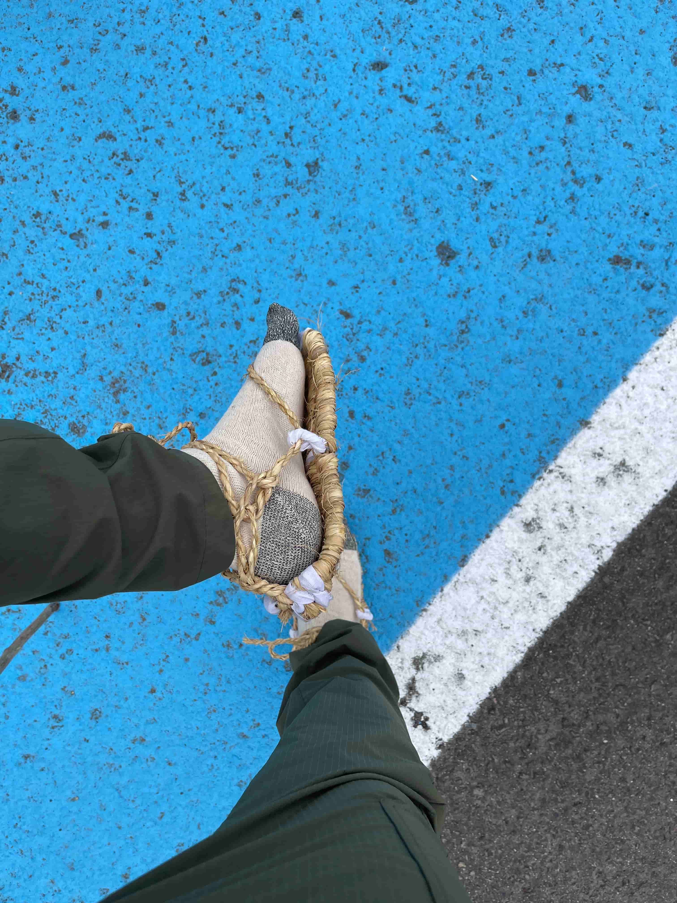
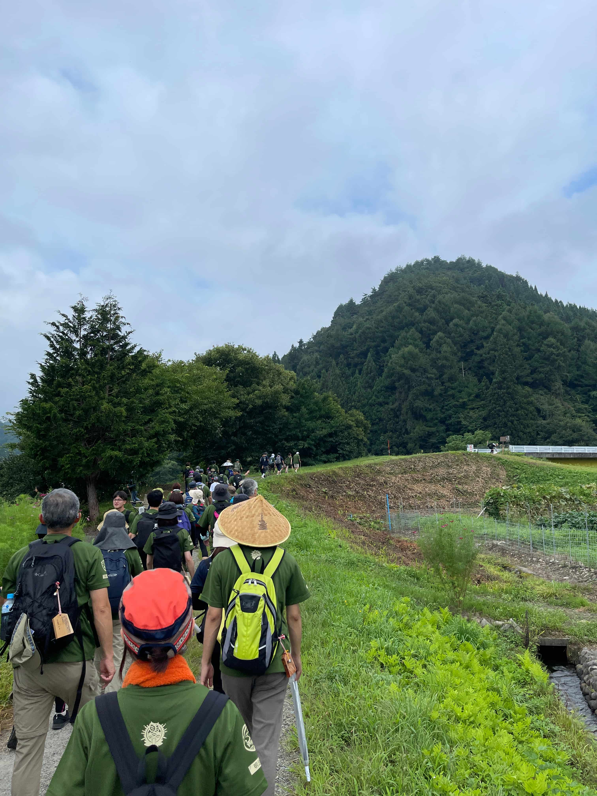

## September

Got to stay in a very expensive onsen in Yamagata. There's a video about it: https://youtu.be/xYmiU5PSyE0

Family got to come over, and we collected Sunny Angels

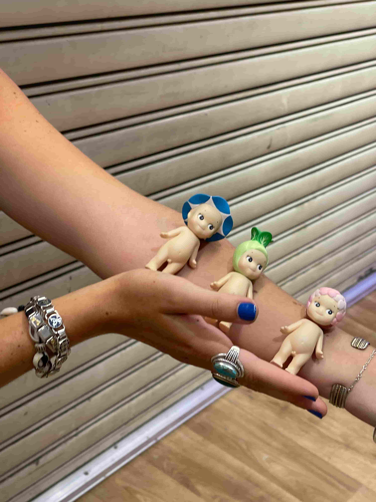

## October

October, perhaps the most uneventful month, still got to see some action. We saw things melt because
of the temperature:

And we got to hike the renowed nipple mountain of Sendai

## November

Got to partake in an [Imonikai](https://en.wikipedia.org/wiki/Imoni)...

...and watch my local team win to get into the J1 playoffs!

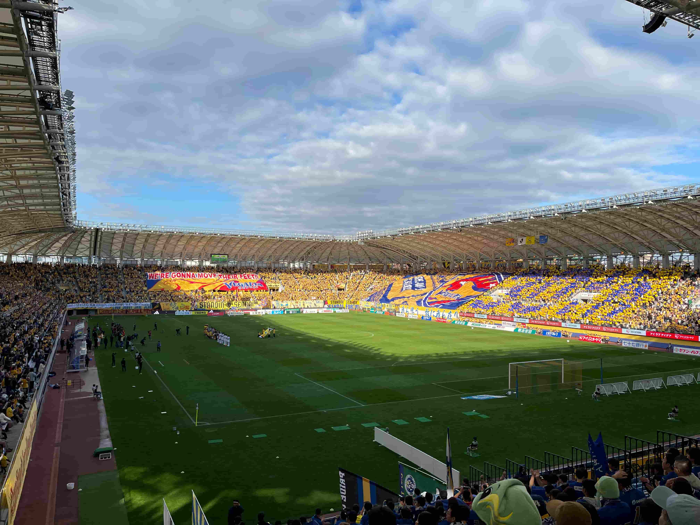

## December

And to end the year as everyone should...by feeding the capitalist machine! Just kidding, by hitting the
slopes:

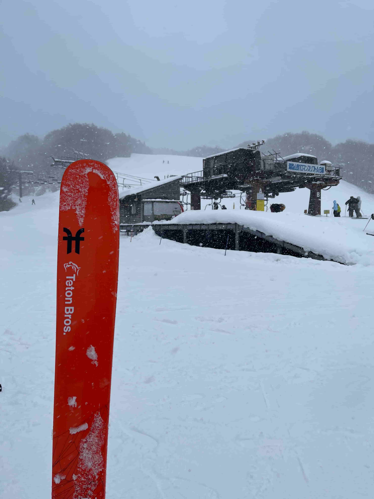

This was in Yamagata.

Looking forward to an eventful 2025. Thank you for reading!