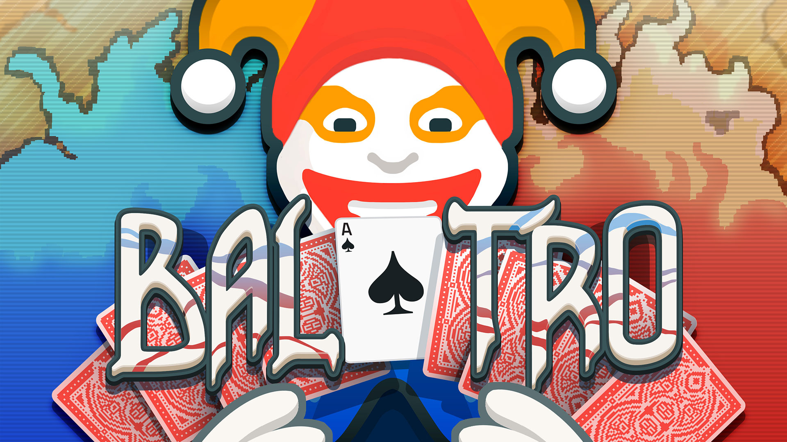
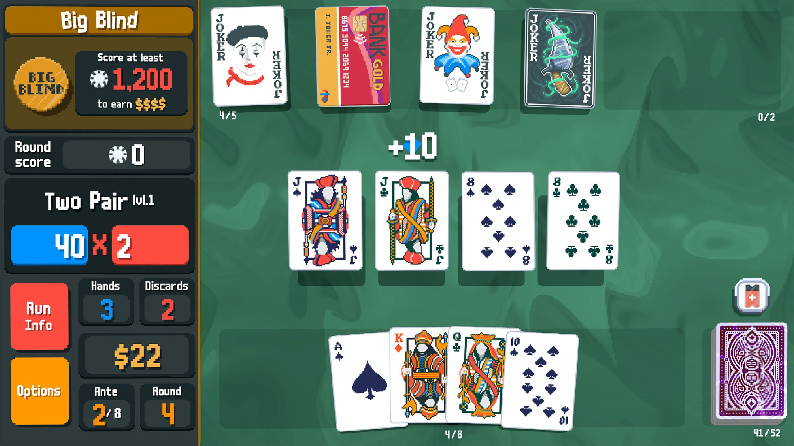

import Card from "./Card.tsx";

[Balatro](https://www.playbalatro.com/) is a card game that has taken the internet by storm as of late. Like many others, I quickly 
became addicted to its simple yet endlessly engaging mechanics. For about $10 or so (on the app store), 
you're getting a ridiculous amount of value and playtime.

Balatro is written with the Löve game engine, which really motivates me to make a game myself. Prior to knowing of Balatro, 
I had this notion that to make a decent game, you need to invest time and effort in learning languages like C++ or Java, and
engines like Unity and what not. I was aware of 2D game engines but a lot of the discourse online was that 
most developers just end up using Unity.

But it is often said that it's not about what language or engine- it's about the execution. And Balatro was executed perfectly.
The game works like this: you have to beat "bosses" or blinds as they're called (poker lingo, I suppose). To do that,
you have to collect a number of points which is done by playing sets of cards (or "hands"). Each card gives you some
number of points, typically its number, and for each particular set you can receive extra points (for example, a flush: 5 cards
with the same *suit*, more poker lingo). The catch is, there are extra "power ups" you can apply to any card, and more
importantly, you can buy cards called "Jokers", which give you some type of conditional power. There is also money involved,
to buy said cards. The bosses also even have some tricks up their own sleeve.
I suggest you read [Wikipedia's description of it](https://en.wikipedia.org/wiki/Balatro_(video_game)#Playthrough) if you're
not convinced.

What I love most about Balatro though, are its interactions. The subtle hover styles, the "springyness" every time you touch a card, or when a card
is scored, is all intoxicating, and I wonder if it is what brings us all back for another round.

<Card client:load/>

<small>My small rendition of a point score interaction ☝️</small>
