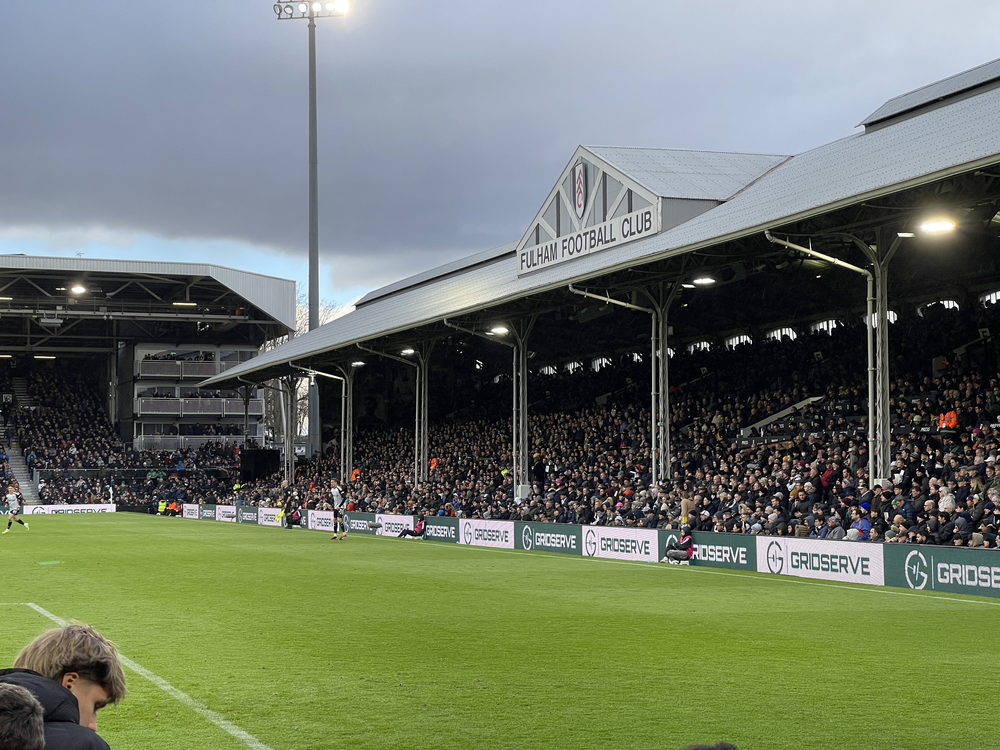

Soon approaching May, I thought it was ample timing to write about my trip to Europe, which happened in last month, early March. The itinerary went as follows: Bus to Tokyo, Tokyo to Shanghai, Shanghai to London, stay 2 days in London, London to Geneva, drive to Chamonix, spend a night, ski, take train to near Stuttgart via Zürich, spend a few days in Germany, Stuttgart to London, spend a night in London, London to Shanghai, Shanghai to Tokyo, take bullet train home. 

Both in hindsight and before the trip, I realized it was going to be (and was) a tiring affair. But yet, it was bareable and worth it in the end, despite my hatred for overnight flights and my lack of ability to sleep anywhere that isn't a flat surface. 

In the following weeks, I felt that the trip had a lasting impact on me, and because of it I've reassessed my values, my goals and what I want in my life. I am still lost as always, but feel that the fog has cleared up a bit more than previously before. There's a lot of feelings involved here, so I want to unpack them while going through what I did.

## London

I have been to London once in my life, and that was with my family when I was very young. I still have fond memories of the trip. Despite that I never really found London to be a prime destination for me. It's big, expensive and rainy. But it does have one very important thing going for it: The English Premier League. The home of the strongest (not the best) football league in the world, and that is enough for me to disregard all its faults. Plus, my friends wanted to go there.

The time in London was short, but wonderful nonetheless. I got to meet with some of my childhood friends as well as make new ones, and was able to watch my very first Premier League match live, namely Fulham vs. Brighton. Living in Japan, I was hoping I would get to see action from Mitoma, but unfortunately he was injured and could not play.

I was ecstatic to be here. While the atmosphere wasn't top notch (when compared to the Bundesliga...), it still felt great. I certainly had a grea time, and the football was really great. I was always curious what the reality of a Premier League match was, and Fulham as a comparatively small team did not dissapoint. How I would rate Fulham: 

* Atmosphere: **6/10** - While it was better than I expected, I still hoped that Fulham would have fostered a closer community that would have fans, "ultras" as they're called sometimes, which help typically with this.
* Food: **3/10** - Easy loss here for Fulham. I had a "meatpie" with a beer which was OK - but that was basically all there was, and here's the kicker though, you're not allowed to drink alcohol in the stands. 
* Stadium: **8/10** - Craven Cottage is a beautiful stadium. I'm a sucker for these smaller, more traditional stadiums. With CC you can feel the history and sit very close to the field, which all contributes to its high score.
* Football:  **7/10** - Fulham played a strong match versus quiet Brighton. The pace was incredible, exactly what you'd expect of a Premier League match. There was chances on both ends, but for goods parts of the match both teams were relatively timid.

What really stood out this trip was not exactly the football, but 
the connection with my friends. I did not know how much I yearned
again that comfortable feeling you have with friends you've known
for years. I really believe now that once you enter your adult years, whenever those are, you really lose the ability to make
any true, good friends. And it's not that you don't lack the will,
but rather the time. It's hard to create friendships that last when so much of it is forced. At a young age, everything is natural and you form a bond that is pretty much impossible to replicate in your adult years. It doesn't mean you can't make friends, but I bet you wouldn't feel as comfortable with them
as you would with your childhood friends. 

These feelings are further exacerbated when I think about 
making friends in a foreign country. I used to think it was
challenge making friends in Europe vs. in the US, but now
I find it less of a challenge when you compare it to making 
friends in Asia. In general, the cultural difference is far
too large that even if you have surpassed the language barrier,
things such as cultural references still hinder the process more
than you'd think. And even though Japan and the US share many
similar cultural matters (like anime), the way they are consumed
and discussed are still quite different. Of course, it's not imposssible, but very difficult. 

Given these thoughts, I felt even closer to my friends now, despite not having seen them for a while. 

## Chamonix

This section...still needs to be written.

## Germany

This section...still needs to be written.

## London, and then Home

This section...still needs to be written.

## Post trip blues

This section...still needs to be written.

