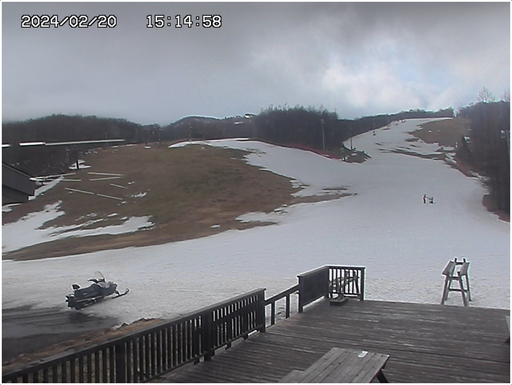
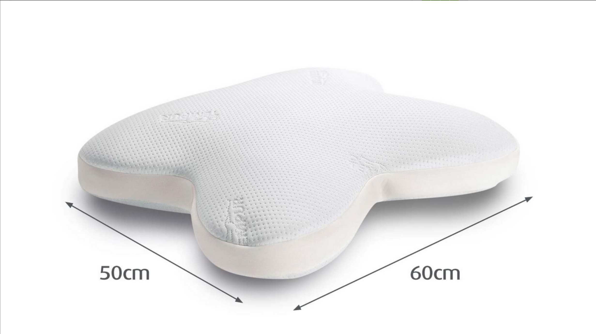

February kicked off with a rough start for me but is coming to a positive end. The theme of this month has been “low temperatures”. I had planned on getting a lot skiing done now that I have a car, but the temperatures have been very unfavorable to the local ski resorts. Looking at past temperature readings, you wouldn’t think it has changed much, but last did not have the best conditions either. This year however the increase in temperature feels more noticeable as many of the local resorts struggle to stay open. It’s a worrying fear of mine that snowfall will continue to decrease such that the mountains will be quite bare during the winter in the next 10 years. Given that temperatures are increasing overall, it’s a good possibility, but I hope that at least some odd weather patterns emerge and we get years with a lot of snow.

<!-- image -->

On Japan’s version of craiglist I was able to find someone who likes to play chess and meet up with him. This was a big win for me as I primarily play chess online and was yearning for more over the board interactions. My opponent played at about the same level as me, just missing a bit of the instinct as his primary game is Shogi. We’ve been able to meet up twice already and I’m happy for that. Having met him has also had me learn that there is a small chess presence in Sendai, and there are even talks of a formidable French opponent which I’m looking forward to playing against.

In February, I’ve started to for the first time, enjoy and understand the Phoenix Elixir framework. Elixir is a functional programming language and Phoenix is a web framework for Elixir. I was introduced to it about two years ago at my previous employer and have been overly curious about it as there is a lot of fervor for the language and its ecosystem. Because of this I’ve been slowly taking the time to learn and Elixir and understand what it is about it that so many developers rage about it. This is the first month I’ve found joy using this language, and I’m starting to understand its appeal a bit more.

## Books I’m Reading

- **Clockwork Boys** - I’ve started reading this as a suggestion from a friend. It’s an enjoyable book, it feels somewhat Young Adultish, but that’s no issue at all.
- **きらきらひかる** (Kira Kira Hikaru) - A Japanese novel that I was told was a relative easy read for Japanese-as-a-second-language readers. It indeed has been a pleasant read.

## What I’m Watching/Watched

- **Love & Death (HBO)** - I binged this true story drama in a few days. It was okay, enjoyable. I liked the the way the film was able to really depict the 1980’s life in somewhat rural Texas.

## Pieces I’m Working On

- Capriche Arabe

## Somethings That Have Stuck

- A particular quote I saw somewhere:
> *The less I have the happier I am*

After having read this quote I was inspired to try and adapt it in my life. I too often find myself wanting things were in many cases I think it can bring less happiness.

<!-- Image -->

Speaking of things to want, I still do believe there are times when having more can be beneficial to you and in this particular instance I am talking about a pillow. My wife has a Tempur-pedic pillow (that’s only sold in the Japanese market, for some reason) that is incredible and is something that has influenced me tremendously. In the rare cases that I was allowed to sleep on that pillow, I felt this may be the only pillow for me. The unfortunate thing here though is that it is a pillow that costs ¥33,000, or $219 and so I have been in search of a pillow just as a good but for at least half the price. The search continues, however…
