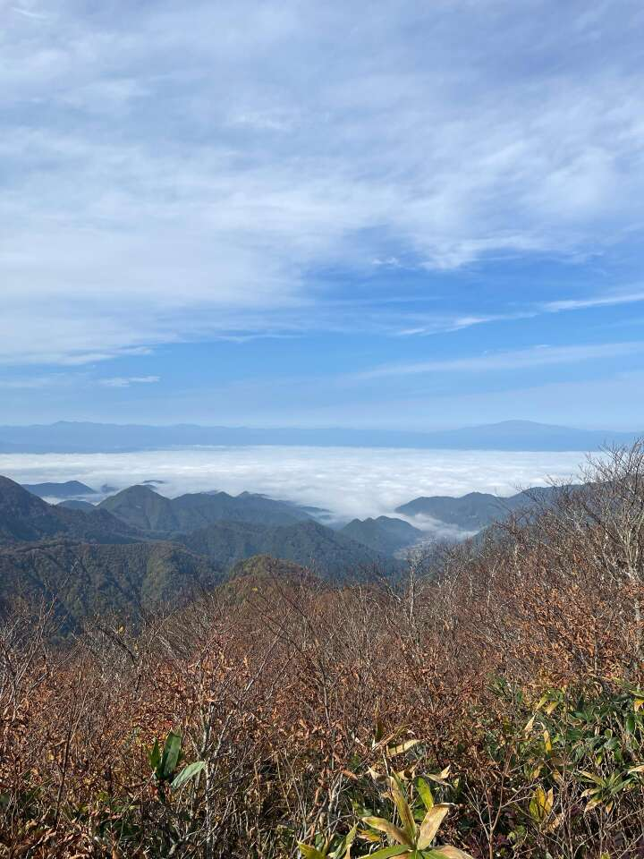
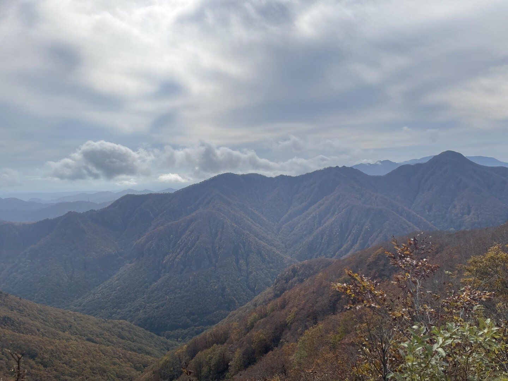

Yesterday, I attempted to hike up a small mountain near Akiu, Miyagi named Koazumadake (小東岳). Unfortunately I failed to reach
my preferred summit, but despite that had an OK time and wanted to document my thoughts.

I started the hike at 9:30am, and the weather was pretty good. Fall foliage around the trail start was gorgeous, so that
alone already put me in good spirits. The route started quite steep and was mostly a climb to the first summit. After that,
I had thought it would be a nice hike as there wasn't much elevation gain to be had, but since I didn't pay attention to the
trail information in my book well enough, saw that there was at least a few more sharp declines I had to do. Worst, is that
the decline was really quite slippery. Weather was starting to get spooky, well, actually just overcast/cloudy.

As I passed my first decline, I was treated to a wonderful array of bushes. Quite a bit of it, and I was starting to lose
sight of the trail, which certainly scared me a bit. After passing the first incline and reaching a second summit (one
before my actual goal), I decided to call it quits and return in the interest of time. I reached the second summit of
"Sanoudake" (山王岳) at around 11:40, I had wanted to reach Koazumadake's summit at around the same time. Since there was
at least another slipper decline up ahead, I decided to tackle this again next time.

