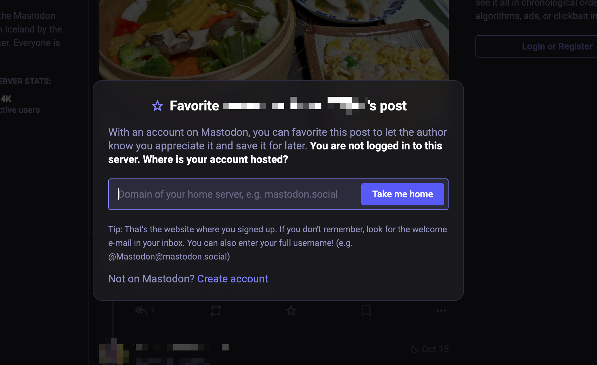
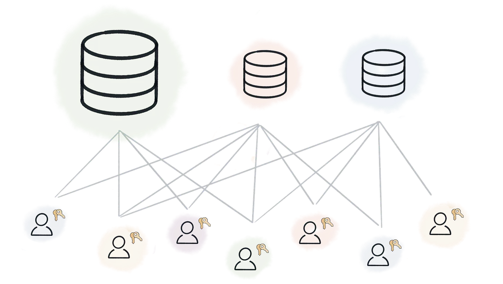

I want to preface this post with a list of technical terms that I will be using:

- **Mastodon** - a decentralized social network, famous for being a social network with no algorithm.
- **Nostr** - a "client-server" protocol, and an acronym for "Notes and Other Stuff Transmitted by Relay"
- **Fediverse** - a general term for for a network of interconnected social media servers that communicate using open protocols like ActivityPub.
- **Activity Pub** - a decentralized social networking protocol that enables different platforms to communicate and share content with each other.

I joined Mastodon when Elon took over. Not because I particularly hated Elon, but because I was intrigued by it (first time I had heard of it), and because there was a instance made for a community I thought I would fit in (famichiki.jp). Since then, I've been exploring the fediverse with interest. A lot of great, fun development is actively being worked on. The most notable for the layman is the wide selection of clients you can use with Mastodon.

Mastodon, and most activity pub services, have a few limitations that I was interested in. The first was that centralization still exists (it always does) in that you are still beholden to rules and decisions of the server admin. This causes problems, such as when the server admins decide to block another server which whom you have connections still. I've seen this play out, were a connection of mine had "beef" with my servers admins, and decided to ultimately block his server from interacting with mine. I think there may be a few ways to overcome this - but ultimately the issue here is that you're not in control.

Another issue with operating within the kingdom of the admins is that they can read your *private* messages. How is this different from Twitter or Facebook? I've often dreamed of the idea of "plugins" within the Mastodon system, to allow you securely message other people, in other servers, with your public and private keys. This would have to be implemented on the client somehow.

Lastly, a particular issue with this server to server architecture, is that you have to choose a server. Servers are typically based on a common interest, or geographical location, or are general. Some servers are localized communities, and this is one thing I really liked about Mastodon. Unfortunately, I often wish to have the opportunity to engage with other communities separately from the current server community I've "involved in", without any overhead. To do this, I would have to open different accounts on different servers. Sure, one can do that, but the obvious issue is that no one wants to handle multiple accounts. Some people might enjoy doing that, but I believe that is not something most people want to do, and I certainly don't. I often contemplated on the idea of what Mastodon could be if one were able to have one account connected to several different communities (or servers, in this case). This to me is sounded like the ideal online social network experience. I often see clients try to overcome this awkward issue by allowing you to browse other servers local timelines...but when it comes time to interact with someone, you always get this awkward "Take me home" pop up, where you need to move back to your instance (or server), read the post from the other instance, ....what???.

So, to further drive my idea home - picture the ability to stay connected with your old classmates, or with people you've met online, or with a network of people living in your area via something akin to "local servers", all with just one account! Well, that is exactly what Nostr seems to try to achieve.

I only just learned about Nostr through this [one post](https://newsletter.squishy.computer/p/natures-many-attempts-to-evolve-a?triedRedirect=true). While the title may be confusing, it starts relatively simple, and tries to explain how the author thinks Nostr is the natural evolution of decentralized networks. So hold on, what is Nostr? With an image (from the article), in short:

With text, in short, it's a protocol were every user is responsible for their own account, and connect with other people via relays, which just transmit your message to others, and others messages to you. Anyone can make a relay. You can connect to any relay, or as many relays, as you want. It seems complex at first, but after some time of thinking about it, it sounds simpler and *better*.

Right off the bat I love this idea of being able to connect to different relays. Simplified, I see Nostr as a collection of local servers, like in Mastodon, which you can freely connect to. You can specify if you want to read and send posts to a relay ("server"), or just read. This type of control is exactly what I'm looking for. I can connect to a relay that is about people talking about life in Japan (famichiki.jp), and one that is people talking and independent software development (indiehackers.social). Essentially what is happening here is that the account management part is offloaded onto the user itself, or the client. The rest of it - the aggregation of posts, liked, reposts, moderation - is still a responsibility of the server (the relay). This solves my main issue with Mastodon, which is the hard tie an account has to a instance/community, and the fact that accounts are just a public and private cryptographic key, there's an opportunity for encrypted messaging, which is not something really feasible on Mastodon, or other fediverse services (afaik).

Other things I've noticed from reading & playing around:
- Hosting your own relay seems far easier than setting up your own fediverse instance.
- Creating accounts is super easy in Nostr. This is great but also can cause problems (easier spam generation).

Now having said all of this, I ignored mentioning the role of cryptocurrency in Nostr. Nostr is considered to be *the* social network for crypto enthusiasts. "Jack" from former Twitter, even donated some huge amount (of bitcoin?) to the development of Nostr. There *even* seems to be first class cryptocurrency support in the protocol. This is not something I want to write about at the moment for various reasons (one being that I haven't fully collected my thoughts yet), but it's something that you should consider before looking into the protocol/social network.
