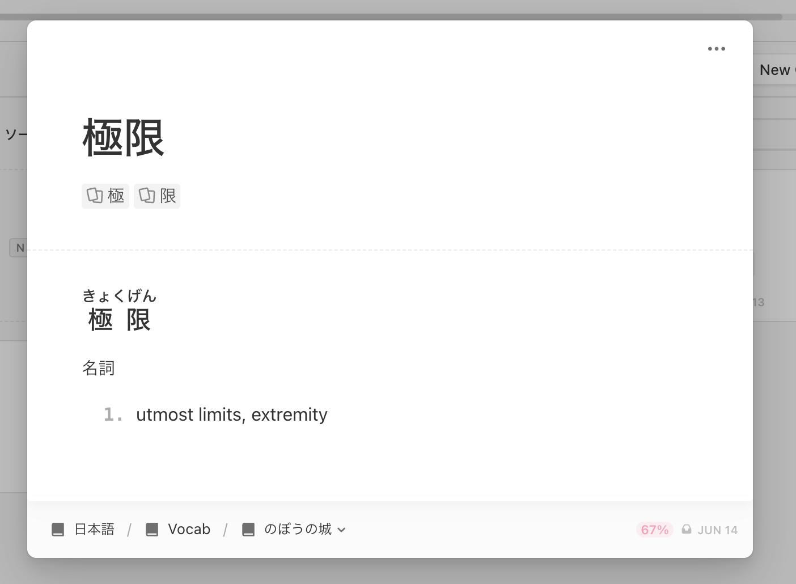
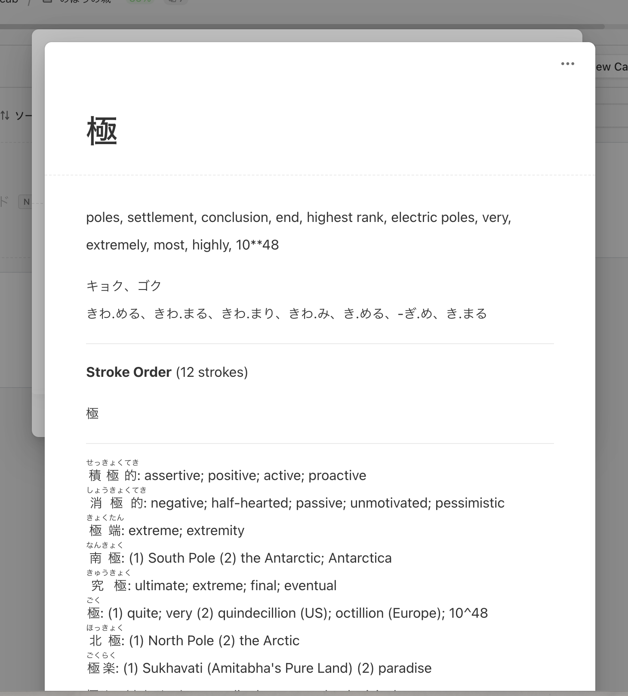

TL;DR: Anki is a great software, but its' UI is poor and hard to use.

Last week I decided to no longer continue to use Anki, the flashcard learning
application that is so dear to me. I've probably been using Anki for over 4 years
now, and while I was never "every-day" consistent, I did use it at least every 3 days a week.

I used to think that Anki would be the center piece of my learning system, and that everything
should and will revolve around Anki. After all, there are so many great resources for it, and
a decent community behind it.

But its clunkiness really made using Anki not fun.

I've been using [Mochi](https://mochi.cards/) for a few weeks now. What makes this app
better is:

1. Great UI (and ultimately UX) right out of the box.
2. Make cards with Markdown (!)
3. Linking (referencing) other cards is a breeze.

The last point is really great and I never thought I'd love it as much as I do.
When I add a new Japanese word/phrase with characters I'm not familiar with, I'll
reference the "Remembering the Kanji" entry for each character, thus giving me
more useful context and applying the learnings you get from RTK:

And then allowing me to view that characters card:

I've been using the same feature for my AWS studies as I prepare for a certificate
exam.

The only thing I miss from Anki is the ability to import directly from Yomichan,
but that comes with a positive aspect: I usually imported far too many
words from Yomichan and ended up with huge decks that I'd never finish.
Plus, inputting in yourself is always better as it reinforces the learning.
