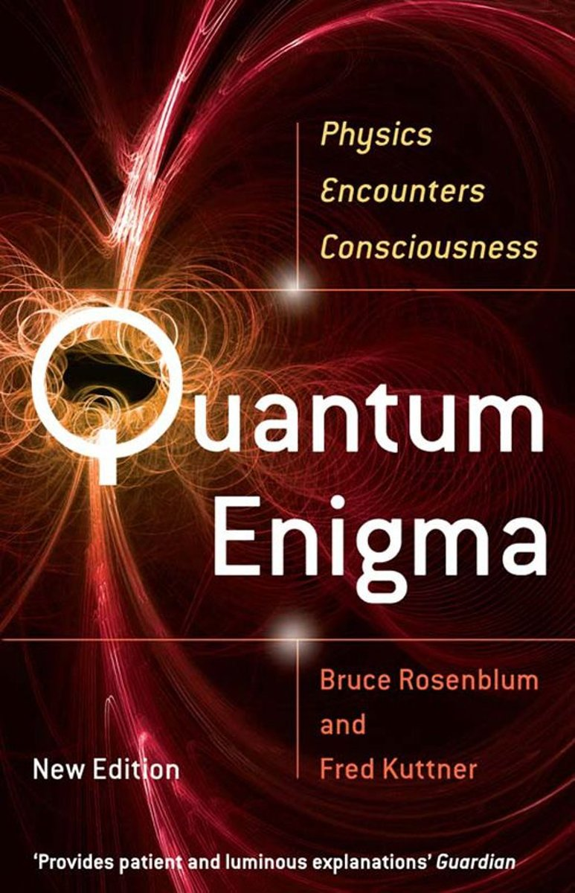

I've finally been able to have a long overdue extended break that has allowed me to clear my mind.
In particular, it's very nice to step away from active coding and I really believe it'll
help me in the long run. Here are a few things I've been looking at as of recent:

## Books

### Quantum Enigma

This book is real fun and has me remembering all my physics courses in Uni.

### Mamita Yunai

## Articles/Magazines

I have a subscription with Wired Magazine (that's soon to expire, but am considering renewing) that's
always a joy to read. I think I'd like to have another subscription of a monthly magazine, but unsure
whether to do something international (New Yorker, The Atlantic, Der Spiegel) or something local (tons of
JP magazines), or something kinda niche (11Freunde), but definitely something. It's nice to stay away
from the computer and actually read something in print.

## Some random thoughts

Recently I've been torn as to what messaging app to suggest to people. I haven't really
explored any others other than Telegram & Signal, so my gripe is just between those two.
I like Signal a lot for the type of organization it is (almost open-source, non-profit),
and its' end-to-end encryption by default feature, but Telegram is a lot more polished
and to my surprise more enjoyable to use, I guess I really like small, thoughtful animations.
But I really dislike that Telegram actively tries to keep you from using e2ee, and
[according to Pavel the CEO](https://telegra.ph/Why-Isnt-Telegram-End-to-End-Encrypted-by-Default-08-14),
its for the better. I still haven't made my mind up on that because I just don't know enough. And speaking
of Pavel, while I do understand this is a bit disingenuous, I'm still wary of his background and his
true motives. He's a billionaire after all, and I have trouble trusting billionaires.

### Cooking/Baking

My father taught me how to make the best bread in the world "Laugenbrötchen" (also referred
to as Laugenweckle, Lye Bread, _Pretzel_).

So now I have an active challenge of re-creating
this in Japan and that starts with the ingredients. For those who don't know, "Lye Bread" uses,
well, Lye, which is referred to as sodium hydroxide or 火星ソーダ (kasei so-da) in Japanese.
I know I can buy this in the drug store, but since it's usually used to make soap or clean your kitchen
sink pipes, I'm unsure if this is still safe to use. Typically in Germany or in the US you can purchase
a food grade version, and what the difference is I'm not sure. I'll write up a more detailed post on it once
I find out what I find out. Another challenge is finding good lard, which is a top secret ingredient
my uncle who has worked in a bakery has told me. The lard I found in the states is in a big block, and needs
to keep refrigerated whereas the lard here comes in a tube that looks like mayonnaise. I don't know how
much that will affect things. More to come.
